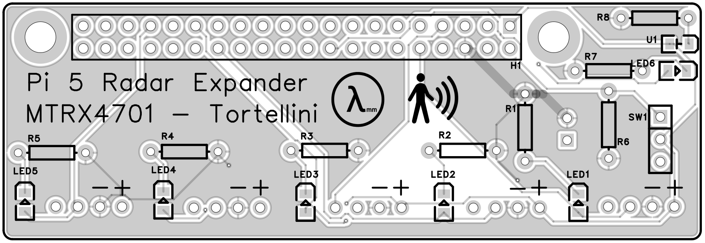

# MTRX4701_Major_Project

## mmWave Radar Module
### Firing it up
To bring up the radar with the default array config file run,
```
ros2 launch mmwave_radar array.bringup.launch.py
```
If you wish to specify a config run,
```
ros2 launch mmwave_radar array.bringup.launch.py array_config_file:=<array-config-file>.yaml
```
Every time the Array Bringup gets run the config file being used gets printed to the terminal window. Which will look something like this,
```
### Launching Array with config v0_frame_custom.yaml ###
```
Each module has it's node within the array's namespace, and the readings get published at a bit under 10Hz. If you were to be running 2 radars (id's 0 and 1) the topics would look like more or less like this.
```
/mmWave_array/radar_0/report
/mmWave_array/radar_1/report
```

### Radar Message Types
The mmWave Radar Modules can operate in a few different modes ranging from just giving distance, to the reporting signal return intensities over it's range, to doing signal returns and doppler shifts for measuring position and velocity.\
Currently it is just doing the signal return report, and publishing this data to the ```StampedReport``` message from ```radar_messages```. The distances for the are broken into ~30cm blocks, and the entire range of the radar is 16 block. The ```StampedReport``` displays the modules estimate of the person's distance in cm, as well as all the intensity values for each block. When being echoed it the message type will look something like this,
```
---
header:
  stamp:
    sec: 1778383501
    nanosec: 265391132
  frame_id: radar0
distance: 122.0
gate_energies:
- 25053
- 28722
- 1040
- 41
- 40
- 37
- 74
- 64
- 34
- 36
- 40
- 65
- 53
- 49
- 58
- 40
---
```

### Array Config Files
These files describe how the radar array has been setup, labelling each radar, specifiying their serial port and their transform from a parent frame. They can be found in the config folder for the package, and will all look something like this,
```
launch_settings:
  radar_modules:
    - identifier: 0
      interface: /dev/ttyAMA0
      parent_frame: base_link
      translation_x: 0.1
      translation_y: 0.092
      translation_z: 0.092
      roll: 0.00
      pitch: 0.00
      yaw: 0.00
    - identifier: 1
      interface: /dev/ttyAMA1
      parent_frame: base_link
      translation_x: 0.2
      translation_y: 0.092
      translation_z: 0.092
      roll: 0.00
      pitch: 0.00
      yaw: 0.00
```

## Pi 5 UART Expander Board

