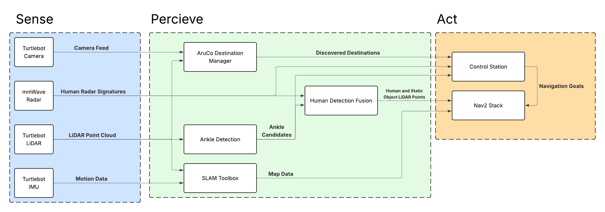

# Experimental Robotics @ USYD<br> Major Project - Tortellini<br>Bot Workspace

Deploying **privacy preserving** modes of **human detection** on the Turtlebot Platform. Performing person tracking with fused **2D LiDAR** and **mmWave radar** data, before incorporating them into a **Nav2** pipeline. Allowing for differentiation between people and static objects while autonomously navigating an environment. 

## System Overview


## Pi 5 UART mmWave Radar Expansion HAT


## Running 
Launch Hardware, then Navigation.\
The QR Destination Node will scream about transforms until the Nav launch file finishes.

### Hardware
```ros2 launch bot_bringup hardware.launch.py```

To spin up all the hardware run the command above. It'll spin up the nodes in two groups, with a 10 second delay between the two.
- Group A
  - Turtlebot LiDAR, Motors, etc.
  - Turtlebot Pi Camera
  - mmWave Radar Array
- Group B
  - People Detection From LiDAR
  - Sensor Fusion People (Radar + LiDAR)
  - QR Code Destination Advertising

### Navigation
```ros2 launch bot_bringup nav.launch.py```

Spins up the navigation related nodes. Launching```slam_toolbox``` in ```online_async```, waits for a few seconds and brings up ```nav2``` with a custom yaml file.

### Nav2 Rviz
```ros2 run rviz2 rviz2 -d /opt/ros/jazzy/share/nav2_bringup/rviz/nav2_default_view.rviz```

## Nav2 yaml 
To run Nav2 with different config files, add them into the ```config/``` directory, and point the Navigation Launch file to it.